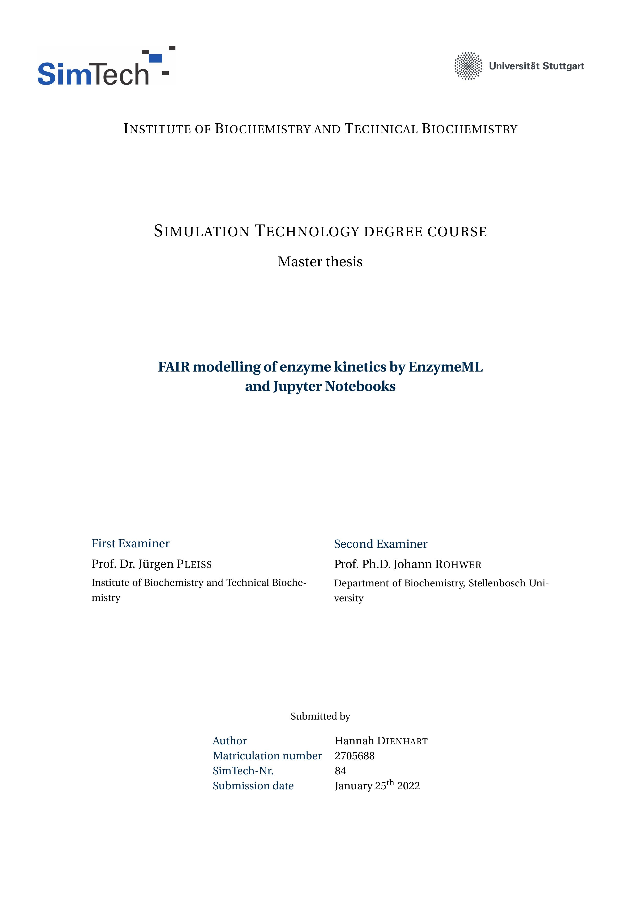

# Welcome

*Welcome to the written report of my master thesis.*

I'm Hannah Dienhart and this website contains my master thesis 
**FAIR modelling of enzyme kinetics by EnzymeML and Jupyter Notebooks** as a Jupyter Book.  
In the course of this thesis I developed many Jupyter Notebooks. 
Here you can find different Scenarios, visualising and modelling the data of some of the __EnzymeML__ project partners.

The final pdf of my master thesis will be automatically generated from this website, only excluding this introductory part. Below you see the tile page of the thesis.

